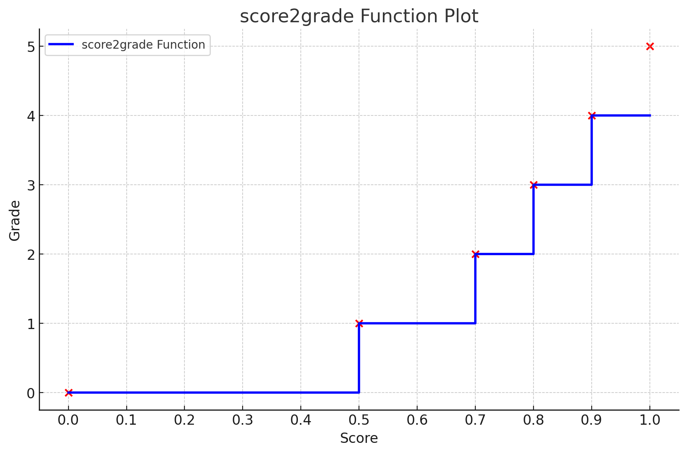

# termilingo


[](https://coveralls.io/github/ayakovlenko/termilingo?branch=main)

## Run

```sh
deno task run --deck example-deck.yaml
```

## Grading

Score to SM2 grade conversion:

| Score range         | Grade |
| ------------------- | ----- |
| 0 ≤ score < 0.50    | 0     |
| 0.50 ≤ score < 0.70 | 1     |
| 0.70 ≤ score < 0.80 | 2     |
| 0.80 ≤ score < 0.90 | 3     |
| 0.90 ≤ score < 1.00 | 4     |
| score = 1.00        | 5     |



<details>

<summary>Plot source</summary>

```python
import matplotlib.pyplot as plt
import numpy as np

# Define the score ranges and corresponding grades
score_ranges = [0, 0.5, 0.7, 0.8, 0.9, 1.0]
grades = [0, 1, 2, 3, 4, 5]

# Extend the score ranges to create steps
extended_scores = []
extended_grades = []

for i in range(len(score_ranges) - 1):
    extended_scores.append(score_ranges[i])
    extended_scores.append(score_ranges[i+1])
    extended_grades.append(grades[i])
    extended_grades.append(grades[i])

# Plot the function
plt.figure(figsize=(10, 6))
plt.step(extended_scores, extended_grades, where='post', label='score2grade Function', color='b', linewidth=2)
plt.scatter(score_ranges, grades, color='red')  # Highlight the points

# Adding labels and title
plt.xlabel('Score')
plt.ylabel('Grade')
plt.title('score2grade Function Plot')
plt.xticks(np.arange(0, 1.1, 0.1))
plt.yticks(np.arange(6))
plt.grid(True)
plt.legend()
plt.show()
```

</details>
